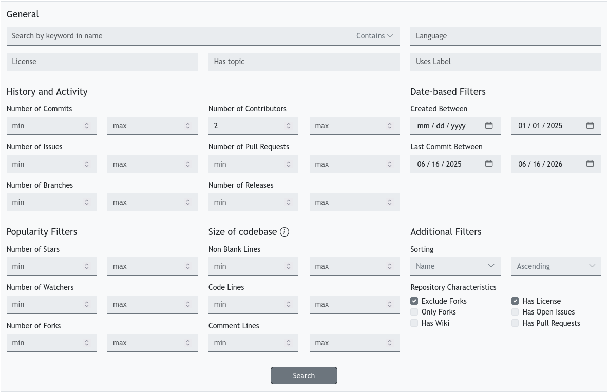

# Documentação de Coleta de Dados

**Ferramenta:** Extração realizada utilizando a ferramenta [seart](https://seart-ghs.si.usi.ch/)

**Data do download:** 16/06/2026

**Versão:** v1.17.1

## Filtros e Parâmetros Utilizados
| Parâmetro                  | Configuração Aplicada             | Objetivo Metodológico                                           |
| :------------------------- | :-------------------------------- | :-------------------------------------------------------------- |
| **Number of Contributors** | `≥ 2`                             | Eliminação de projetos individuais ou simples.                  |
| **Created Between**        | ` ≤ 01-01-2025`                   | Filtrar repositórios que tenham pelo menos um ano de existência |
| **Last Commit**            | `Between 06-16-2025 - 06-16-2026` | Obter repositórios atualizados no máximo um ano atrás           |
| **Forks**                  | `Exclude Forks`                   |                                                                 |
| **Licence**                | `Has License`                     |                                                                 |

Assim como visto na imagem:

### Notas Adicionais
Os dados brutos que foram utilizados nesta pesquisa podem ser acessados por este link https://zenodo.org/records/20724387

## Dados Brutos - SEART

### Contexto
Esta pasta contém os dados brutos exportados da ferramenta **SEART (Search GitHub Repositories)**. Estes arquivos JSON servem como o ponto de partida para todo o pipeline de pesquisa.

### Esqueleto dos Dados (JSON)
Cada entrada no arquivo JSON representa um repositório e contém metadados como:
- `id`: Identificador interno.
- `name`: Nome completo do repositório (`usuario/projeto`).
- `mainLanguage`: Linguagem principal detectada.
- `stargazers`, `forks`, `watchers`: Métricas de popularidade.
- `commits`, `contributors`: Métricas de atividade.
- `createdAt`, `lastCommit`: Datas de criação e atividade recente.
- `size`: Tamanho total do repositório.

### Uso
Estes arquivos são consumidos pelo script `scripts/run_ranking.py` para gerar a lista ranqueada de repositórios.

